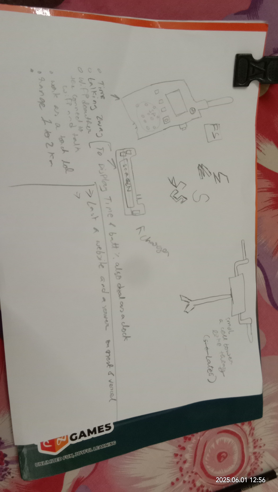
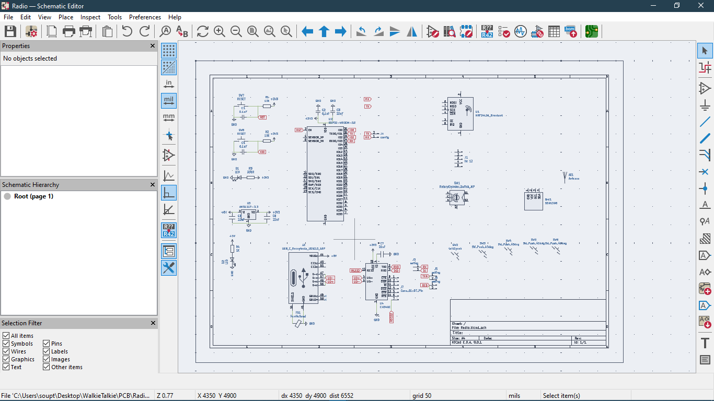

HELLO GUYS I AM SOUPTIK SAMANTA
I AM MAKING A WALKIE TALKIE WITH A RANGE OF 2KM AND DUAL AS A DEAUTHER ALSO IT WILL HAVE NRF CAPABILITES SO U USE THAT TO TALK IN SHORT DISTANCE BUT CLEARLY
### ✅ Total Time Spent: 0
---
| **Date** | **Time** | **Notes** | **Pics / Links** |
|----------|----------|-----------|------------------|
||worked and researched the freqs that are allowed in the indian subcontinets and mesured the distance b/w me nd my neighbour(i wil test this at his home loll) and yea thats it 4hr went in that ,L , but i learned many thinfs too like what happens if we transmit illegaly and moar.||
|1st june |2hr |so today i made the design on paper list the features and future plans || 
|1 JUNE|3.5HR| I LAYED ALL COMPONENTES CONNECTED MOST OF THEM ADDED A USB C INTERFACE WITH A ESP 32 CHIP||
---
